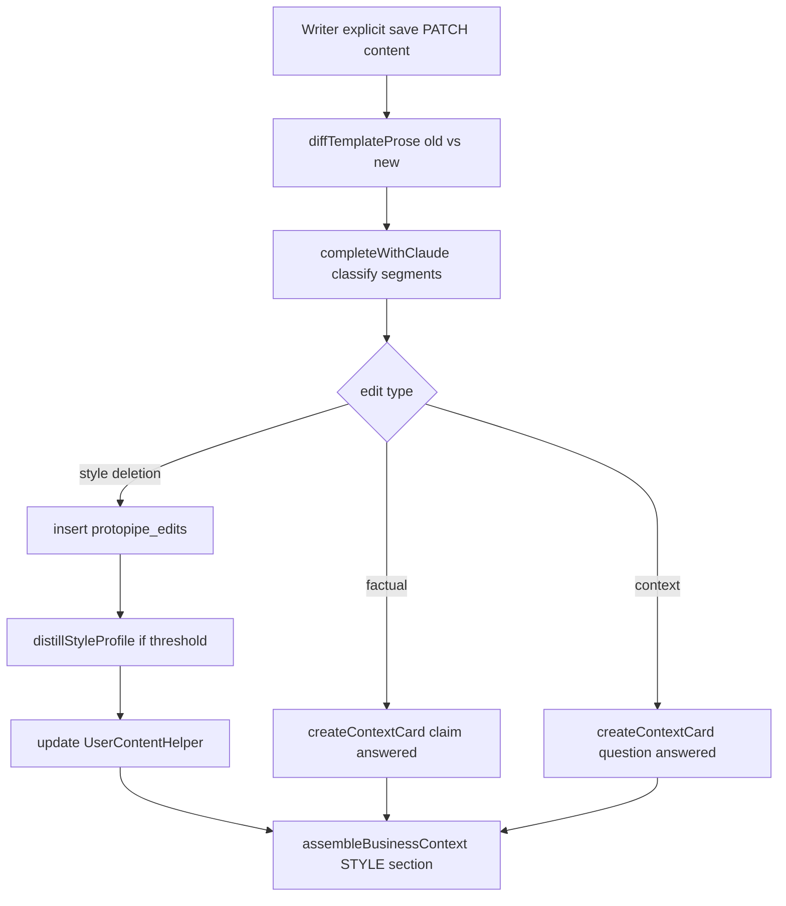

# CP3 — Edit + Style Learning (Agent Handoff)

**Status:** Ready to implement  
**Last updated:** 2026-06-09  
**Prerequisite:** Gates 0 + 1 passed (recommended); CP0–CP2 spine shipped  
**Master plan:** `.cursor/plans/content_intelligence_core_011c4d80.plan.md` (Phase 3)  
**Design spec:** `bagend/services/protopipe/content-intelligence-and-geo.md` (Store 2 — Edits, Store 3 — Style)  
**Sibling doc:** [CONTENT_INTELLIGENCE_REMAINS.md](./CONTENT_INTELLIGENCE_REMAINS.md)

---

## Agent mission

Implement **CP3: writer edit capture → classification → learning loop**.

When an owner explicitly saves in the writer, diff the template prose against the previous version, classify each meaningful change, and route signals into the existing content-intelligence spine:

- **Factual** → answered claim context card (`correctedFrom` populated)
- **Context** → answered question context card
- **Style / deletion** → `protopipe_edits` store → distill into **`UserContentHelper`** (not a new style collection)

**Read first (required):**

1. `sting/docs/protopipe/FEATURE_STANDARD.md`
2. `bagend/services/protopipe/content-intelligence-and-geo.md` — § Store 2 (Edits), § Store 3 (Style)
3. This file end-to-end

**Repos:** bagend (`main`), hive-contracts, sting (`protopipe` branch + Firebase `sting-protopipe`)

**Do not rebuild:** context cards, `assembleBusinessContext`, Sharpen, GEO, offerings, projects — extend only.

---

## What already exists (reuse)

| Piece | Path | Use for CP3 |
|-------|------|-------------|
| Context cards | `bagend/services/protopipe/contentIntelligence/contextCardService.ts` | Route factual/context edits |
| Claim sync pattern | `syncClaimsFromReview.ts` | Mirror for edit-sourced claims |
| Assembly | `assembleBusinessContext.ts` | Already injects `--- STYLE ---` from `UserContentHelper.voice` + `examples` |
| Writer save | `updateContentPost()` in `contentPosts.ts` | **Hook point** — after successful save |
| Sting save | `protopipe-content.service.ts` → `savePost()` → `PATCH .../content/:postId` | No Sting change required if hook is server-side |
| LLM | `completeWithClaude()` in `protopipeLlmService.ts` | Classification + style distillation |
| UserContentHelper | `mongoModels/protopipe/UserContentHelper.ts` | Extend schema for distilled style |

---

## Architecture



**Key principle:** Edits are an *input source* to the same spine as discovery, GEO, and review claims — not a parallel system.

---

## Checkpoints

### CP3a — Diff + persist edits

**Build:**

| File | Action |
|------|--------|
| `bagend/mongoModels/protopipe/Edit.ts` | New model `protopipe_edits` |
| `bagend/services/protopipe/contentIntelligence/diffTemplateProse.ts` | Extract prose text per block/slot; segment-level diff |
| `bagend/services/protopipe/contentIntelligence/captureContentEdits.ts` | Orchestrate: diff → classify → route |
| `bagend/services/protopipe/content/contentPosts.ts` | Call `captureContentEdits` from `updateContentPost` **after** `found.save()` |

**Hook (integration point):**

```199:297:bagend/services/protopipe/content/contentPosts.ts
export async function updateContentPost(input: {
  // ...
}): Promise<...> {
  const found = await getContentPostForSite(...);
  // CAPTURE: snapshot old template BEFORE mutating found.*
  const previousTemplate = getTemplateFromPost(found);

  // ... existing mutation + found.save() ...

  await found.save();

  // CP3: best-effort async — must not fail save
  void captureContentEdits({
    accountId: input.accountId,
    siteId: input.siteId,
    userId: /* from route — pass ownerUserId into updateContentPost */,
    postId: found._id,
    articleId: found._id,
    previousTemplate,
    nextTemplate: template,
  }).catch(err => console.warn('[cp3] edit capture failed', err));

  return { post: contentPostToDto(found, seoValidation), seoValidation };
}
```

**Route change:** `protopipeRoutes.ts` PATCH handler must pass `authUserId` / `ownerUserId` into `updateContentPost` (today it does not).

**Edit document schema** (adapt design doc; use `protopipe_` prefix):

```ts
{
  siteId, accountId, userId, contentPostId,
  segment: { blockId?, slotId?, type: 'sentence' | 'paragraph', position, original, edited },
  classification: { type: 'style' | 'factual' | 'context' | 'deletion', confidence: number },
  signals: { lengthDelta, replacedWords?, structureChange?, deleted?, added? },
  source: { stage: 'writer_save' },
  createdAt
}
```

**Diff rules (v1 — keep simple):**

- Compare prose-bearing blocks only (`kind: 'prose'`, markdown body fields)
- Ignore image URL / alt / embed-only changes
- Min segment length: ~20 chars changed or wholesale paragraph replace
- Skip if `previousTemplate` deep-equals `nextTemplate` prose

**Tests:**

- `diffTemplateProse.test.ts` — price change in one block → one segment
- Image-only change → zero segments
- `captureContentEdits` with mocked classifier → edit row created

**Out of scope CP3a:** LLM classification (stub `type: 'style'` OK for first merge if needed).

---

### CP3b — Classification + routing

**Build:**

| File | Action |
|------|--------|
| `bagend/services/protopipe/contentIntelligence/classifyEditSegment.ts` | Claude call per segment (batch ≤5 per save) |
| `bagend/services/protopipe/contentIntelligence/routeClassifiedEdit.ts` | Route to cards or edits store |

**Classification prompt** (from design doc § Edit classification):

```
Classify this text edit:
Original: [AI text]
Edited:   [user version]

Is this primarily:
A) style preference (tone, word choice, structure, length)
B) factual correction (price, timeline, spec was wrong)
C) context addition (info the AI didn't have about this business)
D) deletion (content the user doesn't want)

Output JSON only: { type, confidence, signal }
```

**Routing:**

| Type | Action |
|------|--------|
| `factual` | `createContextCard({ type: 'claim', status: 'answered', answer: { value: edited, correctedFrom: original }, source: { stage: 'writer_save', articleId }, topic: heuristic })` |
| `context` | `createContextCard({ type: 'question', status: 'answered', answer: { value: edited }, cardText: derived question, source: { stage: 'writer_save' } })` |
| `style` / `deletion` | Insert `protopipe_edits` only |

**Dedupe:** Same `(siteId, original hash, edited hash)` within 24h → skip.

**Defer (explicit):** consistency enforcement, `impact.affectedArticles`, targeted sentence regen — CP4.

**Tests:**

- Mock classifier `factual` → claim card with `correctedFrom`
- Mock `context` → answered question card
- Mock `style` → edit row, no card
- Save still succeeds if classifier throws

---

### CP3c — Style distillation + assembly

**Build:**

| File | Action |
|------|--------|
| `bagend/mongoModels/protopipe/UserContentHelper.ts` | Add optional fields (below) |
| `bagend/services/protopipe/contentIntelligence/distillStyleProfile.ts` | Run when `style` edit count ≥ threshold |
| `bagend/services/protopipe/contentIntelligence/assembleBusinessContext.ts` | Extend `--- STYLE ---` block |

**UserContentHelper extensions** (prefer extending over new `styleProfiles` collection):

```ts
styleLearning?: {
  editCount: number;
  version: number;
  lastDistilledAt?: Date;
  brief?: string;           // distilled style brief
  avoidPatterns?: string[];
  preferPatterns?: string[];
  editExamples?: Array<{ original: string; edited: string; signal?: string }>;
}
```

**Thresholds (v1):**

- **Phase 1 few-shot:** After first style edit, inject up to 3 recent before/after pairs into article prompts (via assembly)
- **Phase 2 distill:** After **15** style edits, run distillation pass; re-run every **10** new style edits

**Distillation prompt** (design doc § Phase 2):

> Here are N before/after edit pairs from a single user. Identify vocabulary replacements, sentence length preference, tone, consistent deletions/additions. Output JSON: `{ brief, avoidPatterns, preferPatterns, topExamples: [{original, edited, signal}] }`

**Assembly injection order** (extend existing style section):

```
--- STYLE ---
Tone: ...
Never use: ...
Distilled brief: ...
Prefer: ...
Avoid: ...
Edit examples (match "after" voice):
Before: ...
After: ...
```

**Tests:**

- Snapshot `buildContextBlock` / assembly with `styleLearning.brief` set
- `distillStyleProfile` mock LLM → helper updated, version incremented

**Sting UI (minimal v1):** None required for Gate 3 — optional later: show "Style learning: N edits" in content helper settings.

---

## Contracts (hive-contracts)

| Change | Required? |
|--------|-----------|
| `UserContentHelperDto` style fields | Yes, if exposed via existing GET/PUT content-helper |
| New public edit APIs | **No** — internal bagend only for v1 |
| `source.stage: 'writer_save'` on ContextCard | Add to union if typed |

---

## Gate 3 — Manual acceptance (~15 min)

| Step | Action | Pass if |
|------|--------|---------|
| 1 | Generate article with wrong price in draft | Draft saved |
| 2 | Edit price in writer prose; **Save** | Save succeeds |
| 3 | Sharpen → Facts (or check context cards API) | Claim with `correctedFrom` OR new answered fact |
| 4 | Generate second article | Corrected price in context; draft doesn't repeat wrong price |
| 5 | Make a style-only edit (shorter sentences); Save twice | `protopipe_edits` rows; after 15+ style edits, distilled brief in helper |
| 6 | Third generation | Noticeably closer to edited voice (qualitative) |

---

## Out of scope (CP3)

- Consistency enforcement across published posts
- Targeted sentence regeneration
- Writer UI for edit history
- Client-sent diff (server diffs saved template only)
- Auto-save / debounced capture (explicit save only)
- CP4 `geo_optimized` article type

---

## Implementation order (PR sequence)

1. **CP3a** — Model + diff + hook in `updateContentPost` (classification stubbed)
2. **CP3b** — Classify + route to cards/edits
3. **CP3c** — UserContentHelper extension + distill + assembly
4. **Gate 3 demo** before CP4 work

**Estimated scope:** 2–3 bagend PRs; 0–1 hive-contracts PR; Sting optional.

---

## Deploy

| Repo | Branch | Deploy |
|------|--------|--------|
| bagend | `main` | Push → DO CI (`ENV_FILE` unchanged) |
| hive-contracts | `main` | Publish + bump sting dependency if DTOs change |
| sting | `protopipe` | Firebase `hosting:sting` only if contracts/UI change |

---

## Pitfalls (from CP2)

- **Best-effort:** Edit capture must never block writer save (wrap in try/catch, log warn)
- **IDOR:** All queries scoped `{ siteId, accountId }`
- **Pass `userId`:** Edits are per-user; `UserContentHelper` is `{ userId, siteId }` unique
- **Published posts:** `updateContentPost` rejects edits on published — CP3 hook won't fire (OK)
- **Template vs legacy:** Use `getTemplateFromPost()` for both snapshots; ignore raw `bodyMarkdown`-only saves if template absent

---

## Decision log (pre-filled)

| Decision | Choice | Rationale |
|----------|--------|-----------|
| Style store | Extend `UserContentHelper` | Master plan; onboarding voice already there |
| Classifier | Claude (`completeWithClaude`) | Same provider as pipeline; Gemini reserved for GEO |
| Hook | Server-side on `updateContentPost` | Sting already PATCHes full template; no client diff needed |
| Trigger | Explicit save only | Design spec; avoids noise from autosave |

Add rows to `bagend/services/protopipe/contentIntelligence/DECISIONS.md` as spikes resolve.

---

## References

- Prior work: CP2 `bagend/services/protopipe/geo/`
- Claim matcher pattern: `bagend/services/protopipe/offerings/matchOfferingClaim.ts`
- Context card stages: `bagend/mongoModels/protopipe/ContextCard.ts`
