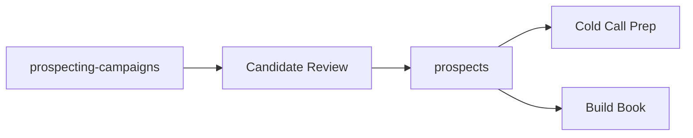

# Protopipe book UI standard

Frontend books are operator workspaces for human-owned Shire books. The backend book owns persisted truth; the frontend book owns review, editing, workflow, and explicit save.

## Backend to frontend contract

| Layer | Responsibility |
| ----- | -------------- |
| Shire book | Site-scoped `GET`/`PUT`, Zod validation, response DTOs, explicit save, proposal commit hooks |
| Contracts | Endpoint constants and shared DTO shapes consumed by Sting |
| Sting API service | Thin `HttpClient` wrapper around one Shire book resource |
| Sting store | Signals for data, draft, dirty, loading, saving, and error state |
| Sting component | OnPush book shell, section nav, edit/review UI, Save actions |

Components must inject stores/facades only. They must not call API services directly.

## Naming

The frontend title may differ from the Shire book name when the product language is clearer:

| Frontend title | Shire book | Purpose |
| -------------- | ---------- | ------- |
| Build Book | `build-book` | Site strategy and demo build state |
| Prospector | `prospecting-campaigns` | Campaign searches, source configs, candidate review |
| Prospector | `prospects` | Canonical sales opportunities and call prep state |

For Prospector, the UI is one workspace backed by two books. The campaign book keeps raw search/candidate state separate from the canonical prospects book.

## File layout

Use a domain folder for API/store/mappers and a home book component for the visual workspace:

```text
features/protopipe/<domain>/
  protopipe-<domain>-shire-api.service.ts
  protopipe-<domain>.store.ts
  <domain>.model.ts

features/protopipe/home/books/
  protopipe-home-<domain>-book.component.ts
  protopipe-home-<domain>-book.component.html
  protopipe-home-<domain>-book.component.scss
```

Reuse an existing domain folder when the UI already exists, such as `features/protopipe/prospector/`.

## Component rules

- Standalone component with `ChangeDetectionStrategy.OnPush`.
- Use `inject()`, `signal`, and `computed`.
- Use `@if` and `@for` in templates.
- Use explicit Save; no autosave on keystroke.
- Show loading, saving, dirty, and error states.
- Track editable rows by stable `id`; new rows use `temp-${crypto.randomUUID()}` until the server assigns an id.
- Keep component methods as UI orchestration; validation and payload mapping belong in the store.

## Store rules

- Load by current `siteId` from the Protopipe strategy/bootstrap layer.
- Keep a server snapshot and a local draft.
- Derive `dirty` from draft versus snapshot.
- Parse API errors with `parseProtopipeApiError()`.
- Save full-list books by sending the complete draft list.
- After save, replace snapshot and draft with the server response.

## Shire API service rules

- One thin service per consumed Shire book resource.
- Build URLs with `shireApiUrl(ShireEndpoints...)`.
- Return typed DTO promises via `firstValueFrom`.
- Do not contain UI state, product copy, or business workflow decisions.

## Prospector standard

Prospector is the standard sales-intelligence book UI:



The first implementation should:

- Show campaigns and prospects in one workspace.
- Save prospect edits to Shire `prospects`.
- Keep raw search candidates in `prospecting-campaigns`.
- Promote a prospect into Build Book with `BuildBookProspectContext`.

## Build Book shell (Protopipe)

Top tabs beside the Books back control:

| Tab | Purpose |
| --- | ------- |
| Templates | Template library only |
| Homepage | Page editor (canvas + builder rail + inspector) |
| Landing Pages | Page list + same editor shell per landing page |
| SEO Strategy | Site images and strategy |
| Content Posts | Placeholder |

URL sync: `?view=build-book&tab=homepage` (legacy `chapter=homepage` and `subview=homepage` still read on load). Landing page selection adds `page=<pageId>`.

Left builder rail (page editor): **Stack** shows the page TOC (reorder, select, remove). **+ Add block** swaps the same panel to a **pattern catalog** (patterns only — no insert). Picking a pattern enters **pending-add** mode: the canvas shows a ghost block at the insert position, the inspector opens **Layout**, and the user picks a variant/layout to commit. Esc or Back cancels pending-add and returns to Stack.

Right inspector rail: **Content** | **Layout** | **Media** | **Links**. Layout is the variant picker for both new blocks (pending-add) and existing blocks (e.g. hero layout swap via `selectBaselineLayoutOption`).

### Pending-add manual checks

- **+ Add block** opens pattern catalog; clicking a pattern does not insert yet.
- **Hero** (or other pattern) → Layout tab opens, canvas shows ghost at insert position.
- **Pick layout/variant** → block inserts at correct index, ghost disappears, stack view returns.
- **Esc / Back** cancels pending-add without mutating the page.
- **Edit existing hero** → Layout tab still swaps via `selectBaselineLayoutOption`.
- **Single-variant pattern** → Layout list shows one row; explicit click required to commit.

Run `npm run validate:build-book` before merge when touching baseline catalogs or assemblies.

## Site Design System

Homepage, landing pages, and (future) blog-post page editors share one **site design context** resolved from the selected template, Media Studio assets, in-use block images across all pages, and Brand Book palette when present.

- **Materialization:** `materializeBlockPropsForInsert()` powers pending-add ghost preview, commit insert, and Layout option cards — same inputs produce the same props.
- **Media:** Slot assignment prefers page in-use → site-wide in-use → uploaded → generated → template stock → themed SVG placeholder.
- **Theme tokens:** `--bb-*` CSS vars on the canvas host; pattern catalog and layout previews tint from site accent.
- **Docs:** See [SITE_DESIGN_STANDARD.md](./SITE_DESIGN_STANDARD.md).

### Site design manual checks

- Add block on homepage with uploaded photos in SEO Strategy — ghost and commit use site library, not template stock.
- Repeat on a landing page — current page images preferred over other pages.
- Empty media library — themed placeholder, not Sparky aerial / WRI coast defaults.
- Ghost media matches committed block after Layout variant pick.

## Verification

- Unit test stores and mappers when logic is non-trivial.
- Run scoped ESLint for touched Protopipe files.
- Run the repo's standard build/test command before deploy.
- Smoke test the authenticated Shire endpoints and the UI Save path in production.
