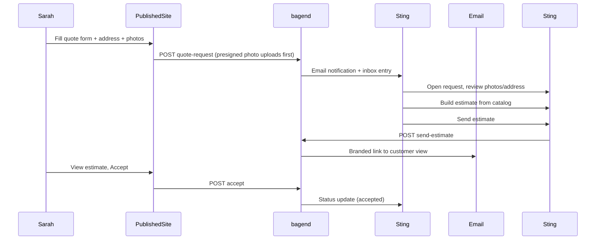

# Landscaping Quote Tool — Brainstorm Deliverable

Research and design notes for a Yardbook/Jobber-tier quote tool as a Protopipe addon. This document completes the brainstorm plan todos — not a build spec.

---

## 1. Persona walkthrough — solo landscaper (Mike, Premier Lawn)

**Profile:** Solo operator, 1 truck, 15–25 active maintenance clients, 3–5 install/cleanup jobs per month. Uses a Protopipe-built site with "Get a free quote" CTA. Currently replies to form submissions by phone and scribbles estimates in Notes.

### Actors

| Actor | Tool | Goal |
|---|---|---|
| Sarah (homeowner) | Published Astro site | Request quote for backyard patio |
| Mike (contractor) | Sting (Protopipe) | Turn request into priced estimate, send, get approval |
| System | bagend/Shire | Store catalog, requests, estimates, photos, notify |

### End-to-end flow



### Step-by-step (paper walkthrough)

**Monday 9:14 AM — Sarah submits request**

Sarah lands on `premierlawn.com/#quote` (Build Book / landscape-trades theme). She:

1. Types name, phone, email
2. Uses address autocomplete → selects "742 Oak St, Portland OR 97209" (lat/lng stored)
3. Checks "Hardscape / patio" and "Landscape installation"
4. Uploads 3 photos: sloped backyard, existing concrete pad, reference Pinterest-style patio
5. Notes: "Backyard only, prefer pavers, need estimate by Friday"
6. Submits

**System creates:** `QuoteRequest` status `new`, links photos, geocoded address, service tags. Mike gets email: "New quote request from Sarah — Hardscape / patio."

**Monday 10:30 AM — Mike triages in Sting**

Mike opens **Quote Requests → Inbox**. Sees:

- Sarah's contact info
- Map pin at property (from geocode)
- Photo thumbnails (tap to enlarge)
- Service checkboxes she selected
- Notes

He marks status `reviewing`. Does **not** need to create a customer record manually — request carries enough to start an estimate.

**Monday 11:00 AM — Mike builds estimate**

Opens **New estimate from request**. Catalog pre-fills common lines:

| Line | Qty | Unit | Price | Source |
|---|---|---|---|---|
| Site visit / measure | 1 | visit | $0 | catalog (waived) |
| Excavation & base prep | 180 | sq ft | $4.50 | catalog |
| Paver install (standard) | 180 | sq ft | $18.00 | catalog |
| Edge restraint | 48 | lin ft | $8.00 | catalog |
| Haul-off / disposal | 1 | lump | $350 | one-off |

Mike adjusts sq ft after looking at photos (180 vs initial guess of 150). Adds internal note: "Slope may need extra base — confirm on site."

Totals: subtotal $4,754 → 8.5% tax → **$5,158**. Status `draft`.

**Monday 2:15 PM — Mike sends**

Preview shows Premier Lawn branding (logo, colors from site). Customer message: "Good to meet you Sarah — here's what we'd propose for the patio. Happy to walk the yard before you decide."

Send via email → status `sent`, `sentAt` recorded.

**Monday 6:40 PM — Sarah accepts**

Sarah opens link on phone. Sees line items, total, Mike's message. Taps **Accept quote**. Status → `accepted`. Mike sees notification next morning.

**Deferred in v1:** convert to job, schedule crew, invoice, deposit payment.

### Pain points this flow solves

| Today (no tool) | With quote tool |
|---|---|
| Form goes to email, easy to lose | Structured inbox with status |
| Address typos, callback to clarify | Autocomplete + map pin |
| "Can you look at these photos?" via text thread | Photos attached to request |
| Estimate in Notes, re-type for customer | Catalog + line editor → branded send |
| No record of what was quoted | Estimate history per property |

### Gaps discovered in walkthrough

- **Site visit scheduling** — Mike still calls Sarah; defer scheduling to phase 5
- **Revisions** — Sarah may want changes; need `revision_requested` status (Jobber pattern) in phase 3
- **Duplicate requests** — same email/address within 7 days should merge or warn
- **Spam** — public form needs rate limit + honeypot (reuse `marketingLeadRoutes` patterns)

---

## 2. UI benchmark — Yardbook vs Jobber estimate screens

Screenshots require authenticated accounts (Yardbook/Jobber login walls). Field inventory below is sourced from [Yardbook support docs](https://support.yardbook.com/) and [Jobber Help Center](https://help.getjobber.com/) as of June 2026.

### Yardbook estimate form (contractor-facing)

| Field / section | Must-have | Nice-to-have | Notes |
|---|---|---|---|
| Customer select / add | ✓ | | Dropdown + quick-add |
| Company info (auto) | ✓ | | From company profile |
| Line items from catalog | ✓ | | Qty × unit price |
| One-off line items | ✓ | | Not in catalog |
| Subtotal / tax / total | ✓ | | Auto-calculated |
| Discount | | ✓ | v1 optional |
| Payment terms | | ✓ | Defer |
| Customer message | ✓ | | On PDF/email |
| Internal comments | | ✓ | Contractor-only |
| Notes & attachments | ✓ | | Files + photos |
| Lot measurement | | ✓ | Phase 4 — satellite polygon |
| Configurable / optional items | | ✓ | Phase 3 — customer selects add-ons |
| Edit costs / profit view | | ✓ | Unit cost per line — simple margin, not LMN |
| Email / print estimate | ✓ | | Phase 2 |
| Online approval | ✓ | | Phase 3 |

### Jobber quote builder (contractor-facing)

| Field / section | Must-have | Nice-to-have | Notes |
|---|---|---|---|
| Client select | ✓ | | |
| Products & services picker | ✓ | | Searchable catalog |
| Line: name, description, qty, unit price | ✓ | | |
| Optional line items | | ✓ | Customer toggles in Client Hub |
| Line item images | | ✓ | Upsell photos on quote |
| Recommend pre-selected optional | | ✓ | |
| Contract / disclaimer text | | ✓ | Template block |
| Client message | ✓ | | |
| Deposit on approval | | ✓ | Defer payments |
| Preview as client | ✓ | | Before send |
| Send email / SMS | ✓ | | SMS phase 2+ |
| Require signature on approve | | ✓ | Phase 3 |
| Convert to job | | ✓ | Phase 5 |

### Customer-facing (Client Hub / Yardbook online estimate)

| Capability | Must-have | Nice-to-have |
|---|---|---|
| View line items + total | ✓ | |
| Accept / decline | ✓ | |
| Request changes | | ✓ |
| Select optional add-ons | | ✓ |
| E-sign | | ✓ |
| Pay deposit | | ✓ |

### Recommended v1 field set (our tool)

**Quote request form (public):** name, phone, email, address (autocomplete), service checkboxes, notes, photos (1–5).

**Estimate builder (Sting):** client block (from request), line table (description, qty, unit, unit price, line total), subtotal, tax rate, discount, total, customer message, internal notes, attach request photos read-only.

**Customer view (phase 3):** branded header, lines, total, message, Accept / Decline.

Skip for v1: optional line items, e-sign, deposit, lot measurement, profit/cost columns, SMS send.

---

## 3. Address lookup — Google Places vs Mapbox

### Requirement

Quote request form needs address autocomplete + stored lat/lng for map preview and future lot measurement.

### Pricing comparison (June 2026)

| | Google (Places + Geocoding) | Mapbox (Geocoding v6) |
|---|---|---|
| Free tier | 10,000 requests/mo per SKU | 100,000 temporary geocode/mo |
| Autocomplete cost | ~$2.83/1k (session-based: first 12 keystrokes + Place Details termination) | ~$0.75/1k after free tier; **each keystroke = 1 request** unless debounced |
| Geocode cost | $5.00/1k after free tier | Temporary: free to 100k; Permanent storage: $5.00/1k |
| Storage rights | Results stored in our DB (standard geocode) | Temporary default — must use `permanent=true` (+$5/1k) to store lat/lng long-term |
| UX quality | Best for US residential addresses | Good; debouncing required |

### Cost model — 50 quote requests/month (solo operator)

Assuming ~8 autocomplete keystrokes + 1 geocode per submission:

| Provider | Monthly requests | Est. cost |
|---|---|---|
| Google (sessions) | ~50 sessions × (12 autocomplete + 1 Place Details + 1 geocode) | **$0** (within 10k free) |
| Mapbox (no debounce, 8 chars) | 50 × 8 = 400 autocomplete + 50 geocode | **$0** (within 100k free) |
| Mapbox (permanent storage) | Same + permanent flag on geocode | **$0** at this volume |

At **5,000 requests/month** (multi-tenant platform):

| Provider | Est. cost |
|---|---|
| Google | ~$0–25 (still mostly free tier) |
| Mapbox temporary | $0 (under 100k) |
| Mapbox permanent geocode | ~$25 (5k × $5/1k) |

### Existing stack inventory

| Asset | Location | Relevance |
|---|---|---|
| `GOOGLE_PLACES_API_KEY` | bagend env | **Already configured** |
| `geocodeAddress()` | `bagend/services/protopipe/google/geocodeAddress.ts` | Free-form address → lat/lng, cached in SERP flow |
| `googlePlaces.ts` | `bagend/services/protopipe/google/googlePlaces.ts` | Place Details, text search (prospector/SERP) |
| `protopipePlacesRoutes.ts` | `bagend/routes/protopipePlacesRoutes.ts` | Authenticated place details — not public autocomplete |
| Geocoded address cache | `mongoModels/protopipe/GeocodedAddressCache` | Dedupes repeat geocodes |
| Mapbox | — | **Not configured anywhere in bagend** |

### Recommendation

**Use Google Places Autocomplete (New) with session tokens** for the public quote form.

Rationale:

1. Key and geocode helper already exist — no new vendor
2. Session pricing keeps autocomplete affordable
3. Permanent lat/lng storage is unambiguous (no Mapbox `permanent=true` licensing nuance)
4. Same coordinates feed a future satellite lot-measurement map (Google Maps or Mapbox tiles — separate decision)

Implementation sketch (when building):

- New **public** route: `POST /api/v2/public/sites/:siteId/quote-requests/address/autocomplete` — proxy to Places API (keeps key server-side)
- On form submit: store `formattedAddress`, structured components, `placeId`, `lat`, `lng`
- Reuse `normalizeAddressKey()` + geocode cache pattern from SERP routes
- Frontend: debounce 300ms, min 3 characters, terminate session with Place Details or Geocode on selection

Mapbox remains a fallback if Google billing or ToS becomes an issue at scale.

---

## 4. Photo upload — bagend audit

### Existing presigned upload patterns

All use `generateDocumentUploadURL()` from `bagend/aws/aws-config.js` (AWS SDK v4 presigned PUT, configurable `ContentType`, 300s expiry).

| Feature | Service | Route | Key pattern | Limits |
|---|---|---|---|---|
| Content post images | `mediaPresign.ts` | `POST .../content/:postId/media/presign` | `media/{accountId}/{siteId}/{postId}/{assetId}.{ext}` | JPEG/PNG/WebP/GIF, 5MB |
| Project media (batch) | `projectMediaPresign.ts` | `POST .../projects/:projectId/media/presign` | `media/{accountId}/{siteId}/projects/{projectId}/{assetId}.{ext}` | Batch limit, images + video |
| Project share (public token) | `projectMediaPresign.ts` | `POST .../project-share/:token/media/presign` | Same as project | Rate limited |
| Merch book artwork | `merchBookArtworkPresign.ts` | `POST .../merch-book/stationery/artwork/presign` | Merch-specific prefix | Artwork types |
| Documents (Fieldwave) | `documentRoutes.ts` | Tenant-scoped | `{tenantKey}/documents/...` | PDF etc. |

Read URLs: `s3UrlSigner.ts` → `generateReadURLFromKey()` for short-lived GET when bucket is private.

Env dependencies: `AWS_S3_BUCKET`, `AWS_BASE_URL`, `AWS_ACCESS_KEY_ID`, `AWS_SECRET_ACCESS_KEY`, optional `AWS_S3_MEDIA_PREFIX` (default `media`).

### Best pattern to copy for quote photos

**Model after `projectMediaPresign.ts`** — batch presign for multiple files, public upload before authenticated record exists.

Proposed flow:

1. Public form calls `POST /api/v2/public/sites/:siteId/quote-requests/media/presign` with `{ files: [{ fileName, mimeType, fileSize }] }` (max 5)
2. Server returns presigned PUT URLs + `publicUrl` + `assetId`
3. Browser uploads directly to S3
4. Form submit includes `photos: [{ assetId, publicUrl, mimeType, sizeBytes }]`
5. Server validates URLs match expected key prefix before saving request

Proposed key: `media/{accountId}/{siteId}/quote-requests/{requestId}/{assetId}.{ext}`

Or staging keys before request ID exists: `media/{accountId}/{siteId}/quote-requests/staging/{uuid}/{assetId}.{ext}` → move/rename on submit.

Limits for quote intake: **5 photos, 10MB each, images only** (JPEG/PNG/WebP — skip GIF for quote context).

### Gaps vs existing patterns

| Gap | Mitigation |
|---|---|
| Public presign (no JWT) | Site-scoped token or rate limit + CAPTCHA; validate `siteId` exists and is published |
| Orphan uploads | TTL lifecycle rule on `staging/` prefix (7 days) |
| Virus scan | Defer; accept images only, size cap |
| Shire port | Long-term: presign in Shire; short-term: bagend public route matches Protopipe deploy |

---

## 5. Open questions — resolved recommendations

| Question | Recommendation | Rationale |
|---|---|---|
| **First user?** | Protopipe contractors generally; pilot with one landscape-trades site from `client-sites/sites/landscape-mocks` or next real landscaper Build Book | Avoid one-off custom logic; mocks already define form UX |
| **Customer-facing surface?** | Embedded on published Astro sites first; optional Sting link for contractor to send estimate | Matches "site says free estimate" — form lives where CTA is |
| **Contractor portal?** | Sting module under Protopipe (`/protopipe/quotes`) | Reuse operator auth; no second app |
| **Payments in v1?** | No — accept quote only | Yardbook/Jobber defer payment to invoice; reduces PCI scope |
| **Multi-user crews?** | Defer — single operator account per site | Matches solo persona; add roles when scheduling ships |
| **Notifications?** | **Email only in v1** via existing SendGrid path (`sendClientPortalMagicLinkEmail` pattern) | SMS (Twilio) in v2 if contractors ask |
| **Branding?** | **White-label per site** — logo, colors, business name from site profile; small "Powered by Futureproof" footer on free tier only | Protopipe differentiator vs generic Yardbook |

### Notification events (v1)

| Event | Recipient | Channel |
|---|---|---|
| New quote request | Contractor | Email |
| Estimate sent | Customer | Email with link |
| Estimate accepted / declined | Contractor | Email |
| Estimate viewed (optional) | Contractor | Email digest or in-app only |

---

## 6. Sting screen list (sketch)

| Screen | Route (proposed) | Purpose |
|---|---|---|
| Service catalog | `/protopipe/sites/:id/quotes/catalog` | CRUD pricing catalog items |
| Quote inbox | `/protopipe/sites/:id/quotes/requests` | List/filter requests (new, reviewing, quoted) |
| Request detail | `.../requests/:requestId` | Photos, map, notes, "Create estimate" |
| Estimate editor | `.../estimates/:estimateId` | Line items, totals, preview, send |
| Sent estimates | `.../estimates?status=sent` | Track sent/viewed/accepted |
| Settings | `.../quotes/settings` | Tax rate, default message, email template |

Public (client-sites widget or Astro component):

| Screen | Purpose |
|---|---|
| Quote request form | Intake with address + photos |
| Estimate view | Customer accept/decline (phase 3) |

---

## 7. Data model (unchanged from plan — names deliberate)

```
PricingCatalogItem { id, siteId, name, description, unit, defaultPrice, category, active }
QuoteRequest       { id, siteId, customer, address, geo, photos[], services[], notes, status }
Estimate           { id, siteId, quoteRequestId?, customer, lines[], tax, discount, total, status }
EstimateLine       { catalogItemId?, description, qty, unitPrice, unit }
```

Status enums:

- `QuoteRequest`: `new` → `reviewing` → `quoted` | `declined` | `spam`
- `Estimate`: `draft` → `sent` → `viewed` → `accepted` | `declined` | `revision_requested`

---

## 8. Phased roadmap (when building)

| Phase | Scope | Outcome |
|---|---|---|
| 0 — Spike | Catalog CRUD + hardcoded PDF | Validate data model |
| 1 — Intake | Public form + address + photos → inbox | Replaces dead `#quote` buttons |
| 2 — Builder | Line editor, totals, email send | Yardbook/Jobber core |
| 3 — Approval | Customer view, accept/decline | Closes loop |
| 4 — Measurement | Geocode map + sq ft polygon + matrix pricing | Yardbook differentiator |
| 5 — Ops | Quote → job → invoice | Only if customers ask |

---

## 9. Related codebase references

| Path | Role |
|---|---|
| `client-sites/sites/landscape-mocks/` | Static quote form UX reference |
| `sting/.../build-book/blocks/build-close-block.component.ts` | "Request a quote" CTA block |
| `bagend/services/protopipe/content/mediaPresign.ts` | Presign pattern to copy |
| `bagend/services/protopipe/google/geocodeAddress.ts` | Geocoding to reuse |
| `bagend/routes/marketingLeadRoutes.ts` | Simple public lead POST pattern |
| `sting/docs/protopipe/CLIENT_PORTAL.md` | Client-facing auth pattern (phase 3+) |
| `shire/src/modules/books/sales-interactions/` | Different "proposal" — sales pipeline, not job quotes |

---

## 10. Next step before code

Pick pilot site and run Mike/Sarah walkthrough with stakeholder — confirm v1 field set and email-only notifications. Then phase 0 spike in bagend (catalog + estimate schema) before Shire port.
